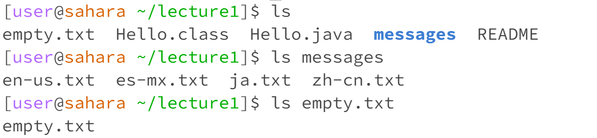
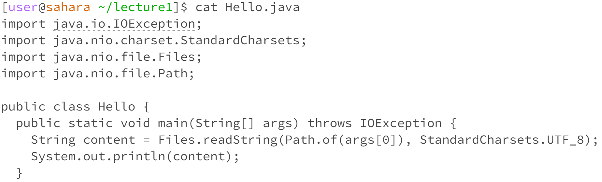

## Lab report 1

**Commands `cd`** 

**An example of using the command with no arguments.** 

I was at directory lecture1 when the command was run. It did not have any output however it moved me back from lecture directory to the home directory. No error was shown.

**An exmaple of using the command with a path to a directory as an argument.** 

I was at home directory when the command was run. It did not have any output however it moves me from home to lecture directory. No error was shown.

**An example of using the command with a path to a file as an argument.**

I was at home directory when the command was run. It outputs an error saying that the destination we are changing is not a directory. Since the purpose of command cd is to change the current working directory to a specified location in the file system, and it expects the destination to be a directory, not a file. In this case, the reason this error showed up because I'm trying to move from current directory to a file which is not allow.

**Commands `ls`**

**An example of using the command with no arguments.**

I was at home directory when the command was run. It outputs list of directory and file, in this case only lecture1 directory was shown. No error.

**An exmaple of using the command with a path to a directory as an argument.**

I was at directory lecture1 when the command was run. It lists the contents of the specified directory. In this case, the output is the all of the contents in the messages directory. No error.

**An example of using the command with a path to a file as an argument.**

I was at directory lecture1 when the command was run. No errow was shown however it only outputs the name of file in the input argument "Hello.java". This is because it does not have any files or directory unders it.

**Command `cat`**

**An example of using the command with no arguments.**

I was at directory lecture1 when the command was run. It waits for input from the teminal, and the user type text directly into the terminal, and cat will display it on the screen. Is not an error, because it is a way to interactively input and view text.

**An exmaple of using the command with a path to a directory as an argument.**

I was at directory lecture1 when the command was run. It outputs an error showing that it is a directory. This is because cat is designed to work with files, not directories. The purpose of the cat command is to display the contents of text files or concatenate the contents of multiple text files.

**An example of using the command with a path to a file as an argument.**

I was at directory lecture1 when the command was run. It outputs the code in the Hello.java file. No errors.
