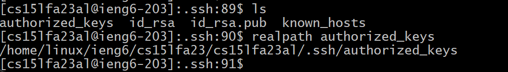

## Lab report 2

**Commands `cd`** 

### **Part 1** 

**Code for my StringServer** 

```
import java.io.IOException;
import java.net.URI;
import java.nio.file.Files;
import java.nio.file.Paths;
import java.util.List;

import java.net.URLDecoder;
import java.nio.charset.StandardCharsets;

class StringHandler implements URLHandler {
  List<String> lines;
  String path;
  int count = 1;
  StringHandler(String path) throws IOException {
    this.path = path;
    this.lines = Files.readAllLines(Paths.get(path));
  }
  public String handleRequest(URI url) throws IOException {
    String query = url.getQuery();
    if(url.getPath().equals("/add-message")) {
      if(query.startsWith("s=")) {
        // String[] array_Strings = query.split("=");
        String decodedQuery = URLDecoder.decode(query, StandardCharsets.UTF_8.toString());
        // String toAdd = "";
        String toAdd = decodedQuery.substring(2); // Remove "s="
        // for(int i = 1; i < array_Strings.length; i++) {
        //   toAdd += array_Strings[i];
        // }
        String adding = String.format("%s. %s", count, toAdd);
        this.lines.add(adding);
        String result = "";
        for(String s: lines) {
          result += s + "\n";
        }
        count++;
        return result;
      }
      else {
        return "/add requires a query parameter s\n";
      }
    }
    // else if(url.getPath().equals("/save")) {
    //   String toSave = String.join("" + lines) + "\n";
    //   Files.write(Paths.get(this.path), toSave.getBytes());
    //   return "Saved!\n";
    // }
    else {
      return String.join("\n", lines) + "\n";
    }
  }
}

class StringServer {
  public static void main(String[] args) throws IOException {
    if(args.length == 0){
      System.out.println("Missing port number! Try any number between 1024 to 49151");
      return;
    }
    if(args.length == 1){
      System.out.println("Missing file path! Give a path to a text file as the second argument.");
      return;
    }

    int port = Integer.parseInt(args[0]);

    Server.start(port, new StringHandler(args[1]));
  }
}
```


**Which methods in your code are called?** 
<li> handleRequest
<li> url.getQuery
<li> url.getPath
<li> equals
<li> query.startsWith
<li> URLDecoder.decode
<li> toString
<li> substring
<li> String.format
<li> add
  
**What are the relevant arguments to those methods, and the values of any relevant fields of the class?** 
<li> handleRequest(URI url): The relevant argument is a type URI url.

<li> url.getQuery(): No relevant argument.

<li> url.getPath(): No relevant argument.

<li> equals(): The relevant argument is a string.

<li> query.startsWith(): The relevant argument is a string.

<li> URLDecoder.decode(): Two relevant argument are first the string of you want to decode, and second the string of name of the character encoding to be used when decoding the string.

<li> toString: No relevant argument.

<li> substring(): The relevant argument is integer.

<li> String.format(): Threr are two parts of relevant argument, first part is the string of thing with "%s" that you want substituted, seconde part is the type of thing you want to substitute in.

<li> add(): The relevant argument is string.

Values of relevant fields of the class:
<li> List<String> lines
<li> String path
<li> int count.
<li> URI url
<li> String query
<li> String decodedQuery
<li> String toAdd
<li> String result
  
**How do the values of any relevant fields of the class change from this specific request? If no values got changed, explain why.** 

The values of two relevant fields List<String> lines and int count within the StringHandler class is change based on this specific request. The line field stores the lines of text read from the file. This field is changeed when the "/add-message" request is received and processed. If a message is successfully added to the list of lines, the lines field is modified to include the new message. The count field is used to keep track the number order of the message. It gets incremented every time when a new message is successfully added in response to an "/add-message" request. So, if a message is added, the count field will be incremented to by 1 starting at 1. Rest of the values that are in the handleRequest are not changed, because every time when the handleRequest is called, those value will be re-created and assigning new values. Unlike value lines and count, they are global values and will only updates or add. In addition global value path is also not changed becauae it is just the path to the txt file for save added words, and no need to be changed.


**Which methods in your code are called?** 
<li> Integer.parseInt
<li> Server.start
<li> Files.readAllLines
<li> handleRequest
<li> url.getQuery
<li> url.getPath
<li> equals
<li> query.startsWith
<li> URLDecoder.decode
<li> toString
<li> substring
<li> String.format
<li> add

**What are the relevant arguments to those methods, and the values of any relevant fields of the class?** 
<li> handleRequest(URI url): The relevant argument is a type URI url.

<li> url.getQuery(): No relevant argument.

<li> url.getPath(): No relevant argument.

<li> equals(): The relevant argument is a string.

<li> query.startsWith(): The relevant argument is a string.

<li> URLDecoder.decode(): Two relevant argument are first the string of you want to decode, and second the string of name of the character encoding to be used when decoding the string.

<li> toString: No relevant argument.

<li> substring(): The relevant argument is integer.

<li> String.format(): Threr are two parts of relevant argument, first part is the string of thing with "%s" that you want substituted, seconde part is the type of thing you want to substitute in.

<li> add(): The relevant argument is string.

Values of relevant fields of the class:
<li> List<String> lines
<li> String path
<li> int count.
<li> URI url
<li> String query
<li> String decodedQuery
<li> String toAdd
<li> String result

**How do the values of any relevant fields of the class change from this specific request? If no values got changed, explain why.** 

The values of two relevant fields List<String> lines and int count within the StringHandler class is change based on this specific request. The line field stores the lines of text read from the file. This field is changeed when the "/add-message" request is received and processed. If a message is successfully added to the list of lines, the lines field is modified to include the new message. The count field is used to keep track the number order of the message. It gets incremented every time when a new message is successfully added in response to an "/add-message" request. So, if a message is added, the count field will be incremented to by 1 starting at 1. Rest of the values that are in the handleRequest are not changed, because every time when the handleRequest is called, those value will be re-created and assigning new values. Unlike value lines and count, they are global values and will only updates or add. In addition global value path is also not changed becauae it is just the path to the txt file for save added words, and no need to be changed.

### **Part 2**

**The path to the private key for your SSH key for logging into ieng6 (on your computer or on the home directory of the lab computer).** 


**The path to the public key for your SSH key for logging into ieng6 (within your account on ieng6).** 



**A terminal interaction where you log into ieng6 with your course-specific account without being asked for a password.** 


### **Part 3**

**In a couple of sentences, describe something you learned from lab in week 2 or 3 that you didn’t know before.** 

During weeks 2 and 3, I learned how to host a server, set up my remote computer, customize my own URL, and modify my web page. I also learned how to avoid entering a password when logging into my remote computer by generating an SSH key and using the scp command to copy files to the remote directory via SSH. These were all things I didn't know before.
