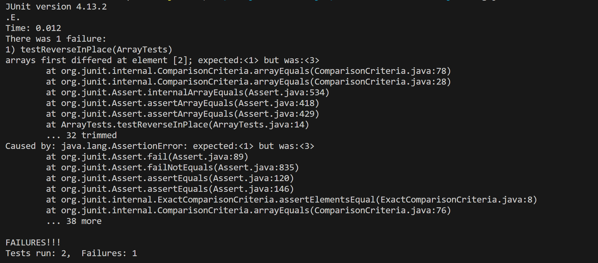

## Lab report 3

### **Part 1** 

**A failure-inducing input for the buggy program, as a JUnit test and any associated code (write it as a code block in Markdown)** 

```
public class ArrayTests {
	@Test 
	public void testReverseInPlace() {
    int[] input2 = { 1, 2, 3 };
    int[] input4 = { 1, 3, 2, 4 };
    ArrayExamples.reverseInPlace(input2);
    assertArrayEquals(new int[]{ 3, 2, 1 }, input2);
    ArrayExamples.reverseInPlace(input4);
    assertArrayEquals(new int[]{ 4, 2, 3, 1 }, input4);
	}
}
```

**An input that doesn’t induce a failure, as a JUnit test and any associated code (write it as a code block in Markdown)** 

```
public class ArrayTests {
	@Test 
	public void testReverseInPlace() {
    int[] input1 = { 3 };
    int[] input3 = { 3, 3 };
    ArrayExamples.reverseInPlace(input1);
    assertArrayEquals(new int[]{ 3 }, input1);
    ArrayExamples.reverseInPlace(input3);
    assertArrayEquals(new int[]{ 3, 3 }, input3);
	}
}
```
  
**The symptom, as the output of running the tests (provide it as a screenshot of running JUnit with at least the two inputs above)** 



**The bug, as the before-and-after code change required to fix it (as two code blocks in Markdown)**

-Before
```
static void reverseInPlace(int[] arr) {
    for(int i = 0; i < arr.length; i += 1) {
      arr[i] = arr[arr.length - i - 1];
    }
  }
```
-After
```
static void reverseInPlace(int[] arr) {
    int[] copy = new int[arr.length];
    System.arraycopy(arr, 0, copy, 0, arr.length);
    for(int i = 0; i < arr.length; i += 1) {
      arr[i] = copy[arr.length - i - 1];
    }
  }
```
**Briefly describe why the fix addresses the issue.**

-The fix addresses the issue by correctly preserving the original array's values during the reversal process. The code bfore, when you modify the elements of the original array within the loop, you are overwriting the elements before they have been copied to their new positions. This results in the array not being reversed properly because you are essentially overwriting values as you go through the loop. The code after the change resolves this issue by first creating a copy of the original array, and then using that copy to correctly reverse the array.

### **Part 2** 


**Find files by types**

```
$ find -type f
[...]
./technical/plos/pmed.0020274.txt
./technical/plos/pmed.0020275.txt
./technical/plos/pmed.0020278.txt
./technical/plos/pmed.0020281.txt
./test.sh
./TestDocSearch.java
./URLHandler.class
```
```
$ find -type d
./lib
./technical
./technical/911report
./technical/biomed
./technical/government
./technical/government/About_LSC
./technical/government/Alcohol_Problems
./technical/government/Env_Prot_Agen
./technical/government/Gen_Account_Office
./technical/government/Media
./technical/government/Post_Rate_Comm
./technical/plos
```

- Using the -type option, you are able to display all files, directories, symlinks, name pipes, sockets, and more. It is useful because I can view all files directly in the terminal instead of checking each of them one by one.

**Limit Listing results**

```
$ find -maxdepth 1 -type d
./lib
./technical
```
```
$ find -maxdepth 1 -type f
./biomed-sizes.txt
./count_txt.sh
./DocSearchServer.class
./DocSearchServer.java
./FileHelpers.class
./find-results.txt
./grep-biomed-files.txt
./grep-biomed.txt
./grep-plos-files.txt
./grep-results.txt
[...]
```

- Using the -maxdepth option, you are able to display all files or directories with a restriction of depth. This is useful because it saves more time, and prevents you from getting much more results from find commands.

**Search a path**

```
$ find -ipath "*/chapter-1*"
./technical/911report/chapter-1.txt
./technical/911report/chapter-10.txt
./technical/911report/chapter-11.txt
./technical/911report/chapter-12.txt
./technical/911report/chapter-13.1.txt
./technical/911report/chapter-13.2.txt
./technical/911report/chapter-13.3.txt
./technical/911report/chapter-13.4.txt
./technical/911report/chapter-13.5.txt
```
```
$ find -ipath "*About_LSC"
./technical/government/About_LSC
```

- Using the -ipath option, you are able to display the path of files or directories with little information about the directory structure. This is useful because sometimes you don't know where the directory structure is located within the system, but only remember the directory structure leading up to the files.

**Find files by age**

```
$ find -type d -mtime -2
./lib
./technical
./technical/911report
./technical/biomed
./technical/government
./technical/government/About_LSC
./technical/government/Alcohol_Problems
./technical/government/Env_Prot_Agen
./technical/government/Gen_Account_Office
./technical/government/Media
./technical/government/Post_Rate_Comm
./technical/plos
```
```
$ find -type f -mtime -2
[...]
./technical/plos/pmed.0020247.txt
./technical/plos/pmed.0020249.txt
./technical/plos/pmed.0020257.txt
./technical/plos/pmed.0020258.txt
./technical/plos/pmed.0020268.txt
./technical/plos/pmed.0020272.txt
./technical/plos/pmed.0020273.txt
./technical/plos/pmed.0020274.txt
./technical/plos/pmed.0020275.txt
./technical/plos/pmed.0020278.txt
./technical/plos/pmed.0020281.txt
./test.sh
./TestDocSearch.java
./URLHandler.class
```

- Using the -mtime option, you are able to display files or directories that have or haven't been modified in certain intervals of time (arguments * 24 hours ago). + means files or directories that haven't been modified, and - means files or directories that have been modified within past time. This is useful because sometimes you want to know which files or directories are modified or not modified at a period of time.

**Citation**

**Kenlon, Seth. “10 Ways to Use the Linux Find Command.” Enable Sysadmin, Red Hat, Inc., 12 Jan. 2023, www.redhat.com/sysadmin/linux-find-command. Accessed 05 Nov. 2023.**

- All examples are from the same website!