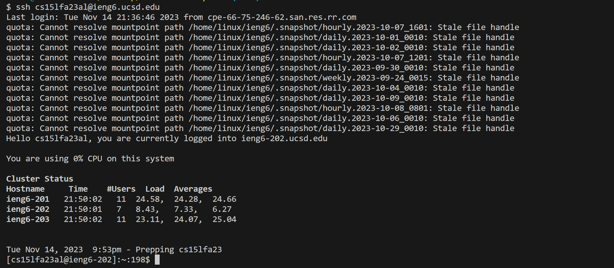
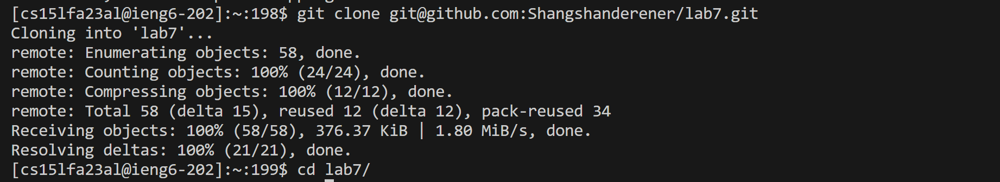
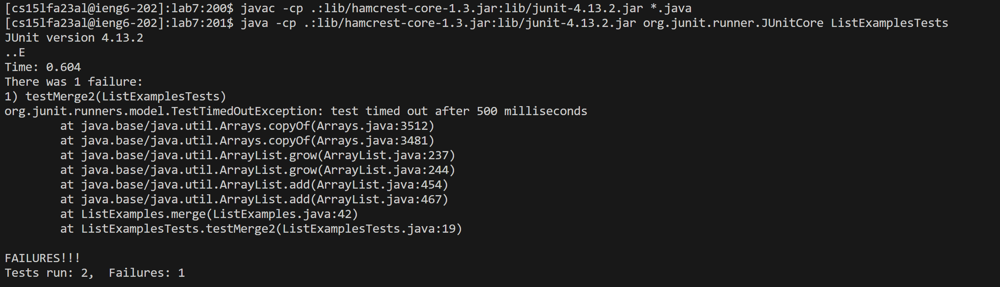
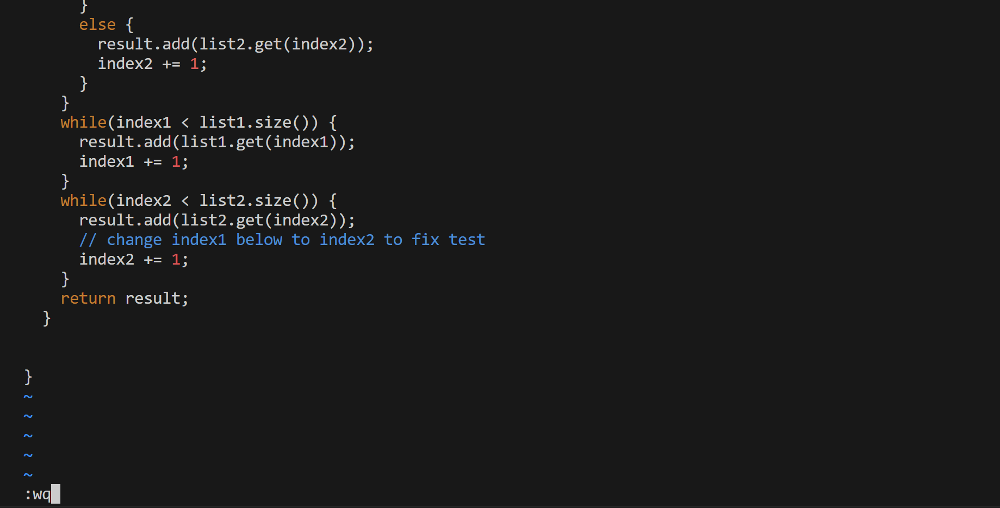
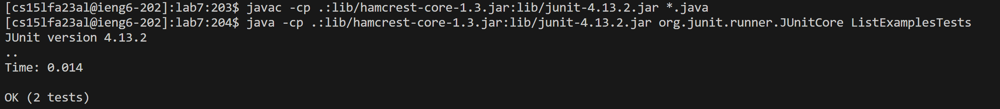
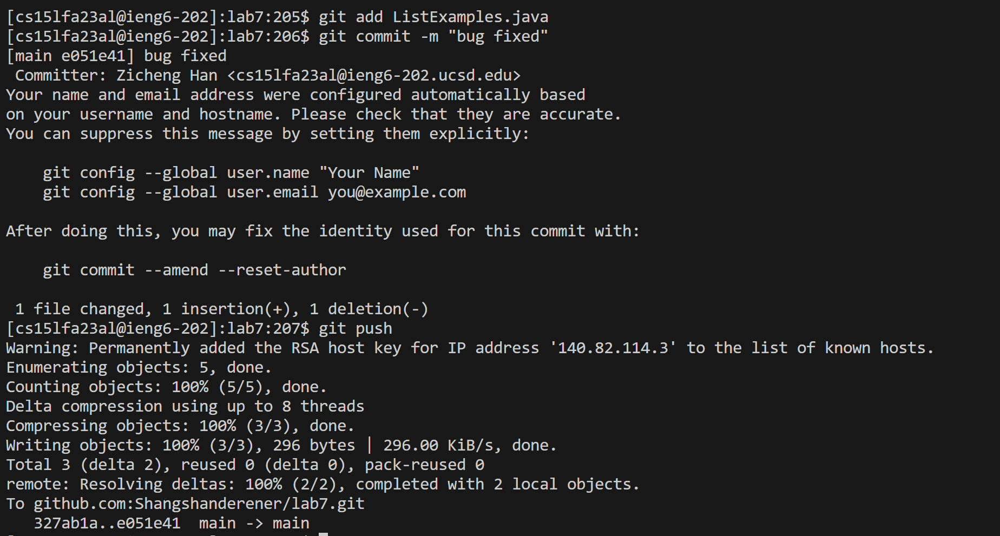

## Lab report 4

### **Numbered step starting right after the timer (steps 4-9)** 


**Step 4: Log into ieng6** 



```
ssh cs15lfa23al@ieng6.ucsd.edu <enter>
```
  
**Step 5: Clone your fork of the repository from your Github account** 



```
git clone git@github.com:Shangshanderener/lab7.git <enter>
cd lab7/ <enter>
```

**Step 6: Run the tests, demonstrating that they fail** 



```
javac -cp .:lib/hamcrest-core-1.3.jar:lib/junit-4.13.2.jar *.java <enter>
java -cp .:lib/hamcrest-core-1.3.jar:lib/junit-4.13.2.jar org.junit.runner.JUnitCore ListExamplesTests <enter>
```

**Step 7: Edit the code file to fix the failing test** 



```
vim ListExamples.java <enter>
<shift> g
<up><up><up><up><up><up>
2w
i
<right>
<backspace>
2
<Esc>
:wq <enter>
```

**Step 8: Run the tests, demonstrating that they now succeed** 



```
<up><up><up><enter>
javac -cp .:lib/hamcrest-core-1.3.jar:lib/junit-4.13.2.jar *.java <enter>
<up><up><up><enter>
java -cp .:lib/hamcrest-core-1.3.jar:lib/junit-4.13.2.jar org.junit.runner.JUnitCore ListExamplesTests <enter>
```

**Step 9: Commit and push the resulting change to your Github account (you can pick any commit message!)** 



```
git add ListExamples.java <enter>
git commit -m "bug fixed" <enter>
git push <enter>
```