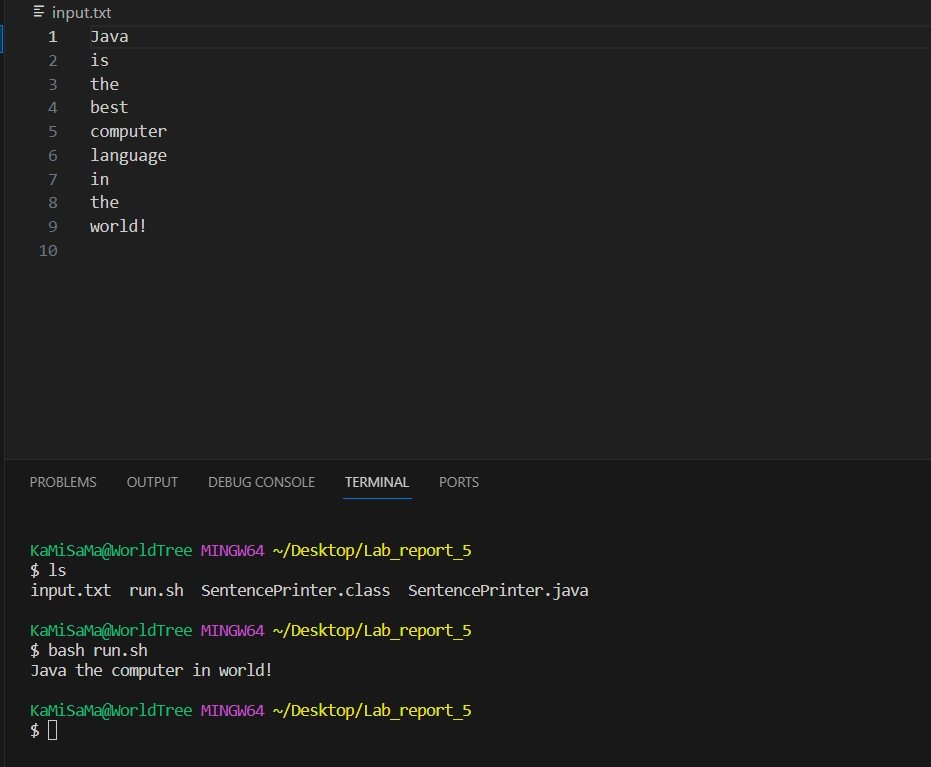
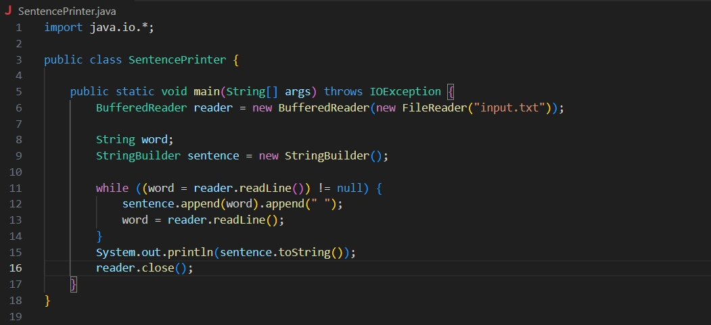
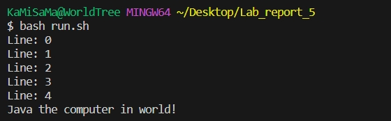

## Lab report 5

### **Part 1 – Debugging Scenario** 


**1. The original post from a student with a screenshot showing a symptom and a description of a guess at the bug/some sense of what the failure-inducing input is. (Don’t actually make the post! Just write the content that would go in such a post)** 

> Original Post on Edstem
>
> Tittle: Java program output is not as expected
>
> Content:
>
> I am currently working on the Java program SentencePrinter.java, which reads each line of word and combine into sentence. I ran the program using a bash script called run.sh. However, output is very odd. The program seems skipped some lines on the display.
>
> Here here is the screenshot after running run.sh
>
> 
>
> Here is my code:
>
> 
>
> I think the bug might be related to reading files and how it processes each line. I'm very confusing right now and wonder what causing this output. Any hint or help would be really helpful! Thanks!

**2. A response from a TA asking a leading question or suggesting a command to try (To be clear, you are mimicking a TA here.)**

> Response from TA:
>
> Hi there, thank you for sharing your code and the output, it makes us much easier to check the problem in your code. I think what you said is probably the problem here. You should try adding a print statement in your loop, this would help you figure out which line is skipped.

**3. Another screenshot/terminal output showing what information the student got from trying that, and a clear description of what the bug is.**

> Student reply:
>
> 
>
> Thank you very much! By comparing new output with my old output, I noticed that indeed my program is skipping lines. I realized that I don't have to call readLine() again at the end of while loop, because my while statement will call it when is running next iteration. 

**4. At the end, all the information needed about the setup including**

**The file & directory structure needed**

- Lab_report_5
  - SentencePrinter.java
  - run.sh
  - input.txt

**The contents of each file before fixing the bug**

```
import java.io.*;

public class SentencePrinter {

    public static void main(String[] args) throws IOException {
        BufferedReader reader = new BufferedReader(new FileReader("input.txt"));
        
        String word;
        StringBuilder sentence = new StringBuilder();
        int line = 0;

        while ((word = reader.readLine()) != null) {
            System.out.println("Line: " + line);
            sentence.append(word).append(" ");
            word = reader.readLine();
            line++;
        }
        System.out.println(sentence.toString());
        reader.close();
    }
}

```

**The full command line (or lines) you ran to trigger the bug**

```
bash run.sh
```
```
### Contents of run.sh
javac SentencePrinter.java
java SentencePrinter
```


**A description of what to edit to fix the bug**
- To fix the bug, I will need to remove the extra readLine() code ( ```word = reader.readLine();```) inside the while loop.


### **Part 2 – Reflection**
- During second half of this quarter, I learned how to use Vim effectively. Initially, I felt a little overwhelmed by Vim's editing and found it very inefficient and hard to use. However, as I continued to learn and practice with partner in the lab section, it became far more efficient at editing individual files on a remote server than I thought. As I mastered some tricks and shortcuts, such as using keyboard shortcuts to quickly navigate through files to edit and perform commands like search and replace or replace all. These techniques significantly speeded up my coding process and gave me a new appreciation for command line tools in software development.