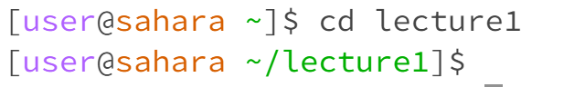
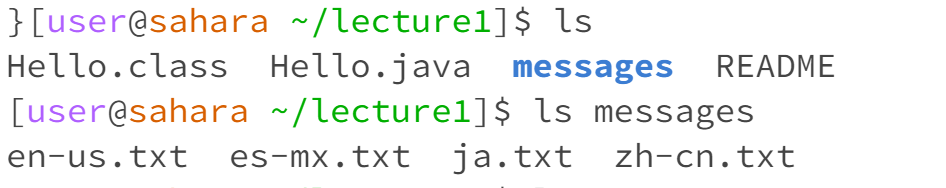
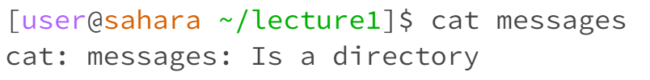
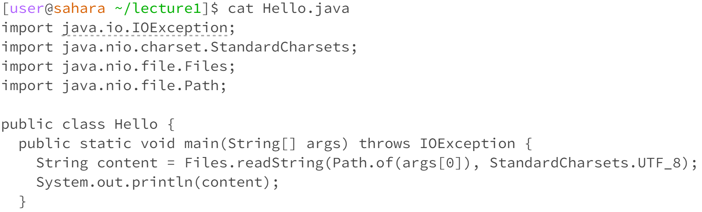

## Lab 1 report

[lab report 1](lab-reports-1.html)

**Commands `cd`** 

**An example of using the command with no arguments.** 

I was at directory lecture1 when the command was run. It did not have any output however it moved me back from lecture directory to the home directory. No error was shown.

**An exmaple of using the command with a path to a directory as an argument.** 

I was at home directory when the command was run. It did not have any output however it moves me from home to lecture directory. No error was shown.

**An example of using the command with a path to a file as an argument.**

I was at home directory when the command was run. It outputs an error saying that the destination we are changing is not a directory.

**Commands `ls`**

**An example of using the command with no arguments.**

I was at home directory when the command was run. It outputs list of directory and file, in this case only lecture1 directory was shown. No error.

**An exmaple of using the command with a path to a directory as an argument.**

I was at directory lecture1 when the command was run. It outputs the list of files in the input argument "messages" because the messages directory is not empty. No error showen.

**An example of using the command with a path to a file as an argument.**

I was at directory lecture1 when the command was run. No errow was shown however it only outputs the name of file in the input argument "Hello.java". This is because it does not have any files or directory unders it.

**Command `cat`**

**An example of using the command with no arguments.**

I was at directory lecture1 when the command was run. It outputs a new line waiting for me to enter a name file. The output is not an error.

**An exmaple of using the command with a path to a directory as an argument.**

I was at directory lecture1 when the command was run. It outputs an error showing that it is a directory. This is because the system can not print out the directory.

**An example of using the command with a path to a file as an argument.**

I was at directory lecture1 when the command was run. It outputs the code in the Hello.java file. No errors.
