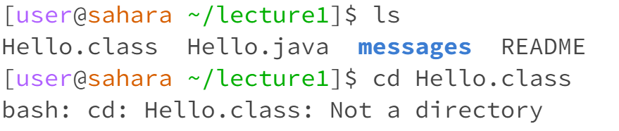
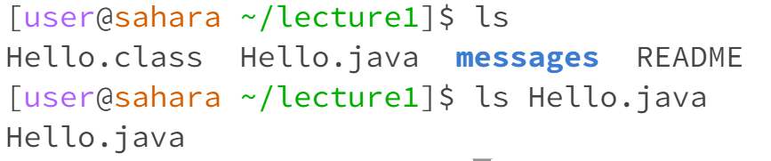
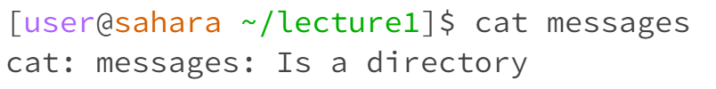
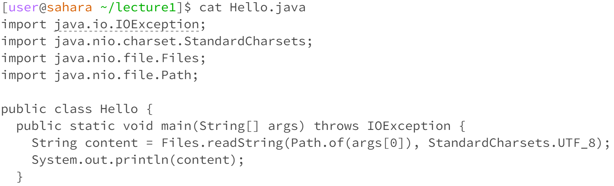

2. What the working directory was when the command was run
3. A sentence or two explaining why you got that output (e.g. what was in the filesystem, what it meant to have no arguments).
4. Indicate whether the output is an error or not, and if it’s an error, explain why it’s an error.

**Commands cd** 

**An example of using the command with no arguments.** 

I was at directory lecture1 when the command was run. It did not have any output however it moved me back from lecture directory to the original position.

**An exmaple of using the command with a path to a directory as an argument.** 

**An example of using the command with a path to a file as an argument.**

**Commands ls**

**An example of using the command with no arguments.**

**An exmaple of using the command with a path to a directory as an argument.**

**An example of using the command with a path to a file as an argument.**

**Command cat**

**An example of using the command with no arguments.**

I was at directory lecture1 when the command was run. It outputs a new line wait for me to enter a name file. The output is not an error.

**An exmaple of using the command with a path to a directory as an argument.**

I was at directory lecture1 when the command was run. It outputs an error showing that it is a directory.

**An example of using the command with a path to a file as an argument.**

I was at directory lecture1 when the command was run. It outputs the code in the Hello.java file.

https://shangshanderener.github.io/cse15l-lab-reports/
